# FinanceManage

本次毕业设计参考于此项目：https://github.com/Woshiajuana/ThePalesInk

参考项目慕课说明：http://www.imooc.com/article/18145

## 前言

感谢本次毕业设计参考项目的大佬，在慕课网上看到他留下的QQ群，加群后请教他很基础的问题，现在想想觉得自己问的问题略微有些弱智。

磕磕绊绊地把项目运行通了，然后着手开始改。

希望最后能顺顺利利地把毕业设计做出来。

## 使用工具

[1、颜色转换工具](https://tools.guardui.net/nose/rgb_hex_color.html)

[2、踏得网（很多现成例子）](http://techbrood.com/)

使用的关键技术

1、语音合成：[MDN文档](https://developer.mozilla.org/zh-CN/docs/Web/API/SpeechSynthesis)、[语音合成频率和音调修改DEMO](https://github.com/mdn/web-speech-api/tree/master/speak-easy-synthesis)

2、语音识别：[谷歌在线语音识别demo](https://www.google.com/intl/en/chrome/demos/speech.html)、[谷歌在线语音识别demo说明博客](https://developers.google.com/web/updates/2013/01/Voice-Driven-Web-Apps-Introduction-to-the-Web-Speech-API)、[语音识别的github地址](https://github.com/googlearchive/webplatform-samples)、[欧拉米语音识别博客](https://blog.csdn.net/ls0609/article/details/73920229#comments)和[GitHub源码](https://github.com/ls0609/WebVoiceRecognize)（但这一个看评论，其他人调通了，为毛我这里总是有问题）

## 使用的框架

[1、Element](http://element-cn.eleme.io/#/zh-CN/component/icon)：icon图标、button按钮、switch开关、slider滑块（有数值）、tag标签、树形控件tree、step步骤条、Carousel 走马灯

[2、Mint UI](http://mint-ui.github.io/#!/zh-cn)：popup（各种方向弹出消息）、lazyload懒加载、range（控制条）、progress（上传文件，动态效果）、PaletteButton（底部跳出圆按钮）、switch按钮

[3、font-awesome](https://fontawesome.com/how-to-use/js-component-packages)：font-awesome图标库

[4、ECharts](http://echarts.baidu.com/echarts2/doc/doc.html)：各种图表

[5、vux](https://doc.vux.li/zh-CN/)：vux Previewer图片放大、WechatEmotion表情、XCircle滑块圆圈调整、

[6、Muse-UI ](http://www.muse-ui.org/#/install)：这UI框架好漂亮简洁，想把饿了么舍弃掉了，Avatar（图标）

## 使用的小技术：

[1、磨砂玻璃效果：](https://www.w3cplus.com/css3/css-secrets/frosted-glass-effect.html)

[2、VueCircleMenu 旋转气泡](https://github.com/OYsun/VueCircleMenu/blob/master/README-ZH.MD)

[3、瀑布布局](https://github.com/MopTym/vue-waterfall)

[4、流星特效](https://www.cnblogs.com/wisewrong/p/7124920.html)

[5、月亮悬浮特效](http://wow.techbrood.com/fiddle/33773)、[一枚月亮波纹](https://www.jianshu.com/p/09db9162d35c)

[6、雪花特效](http://wow.techbrood.com/fiddle/31715)

[7、按钮闪烁星星特效](http://www.htmleaf.com/html5/html5-canvas/201507032158.html)

[8、渐变色深蓝星空](http://wow.techbrood.com/fiddle/27222)

## 运行截图
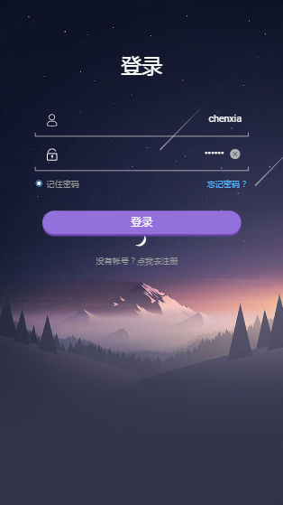

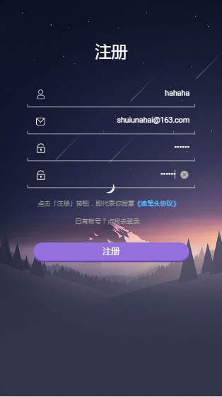

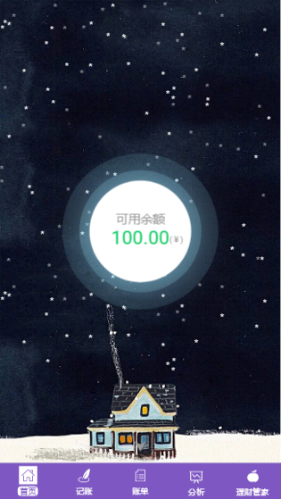

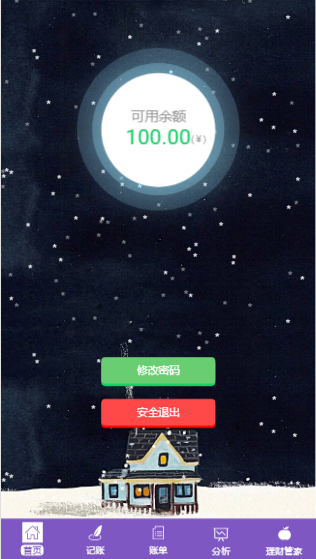

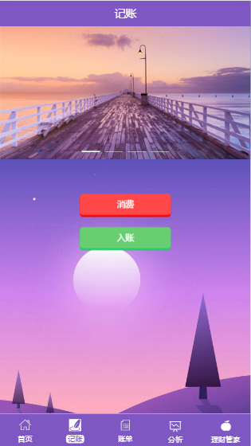

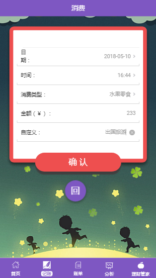

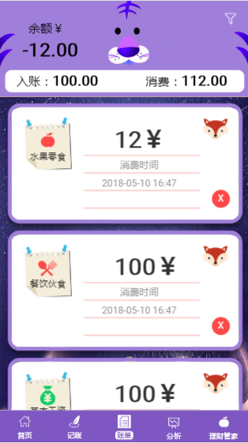

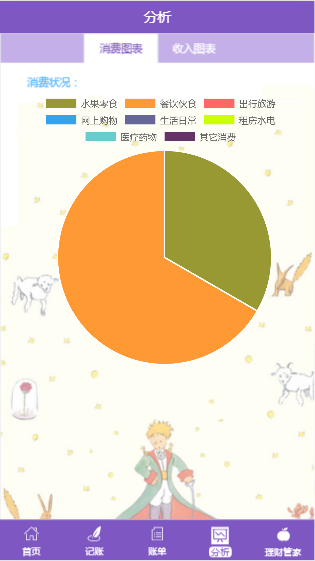

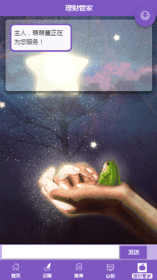

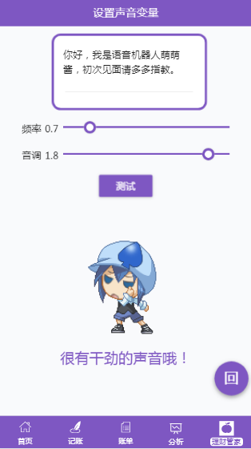

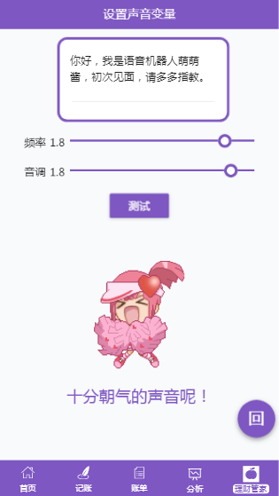

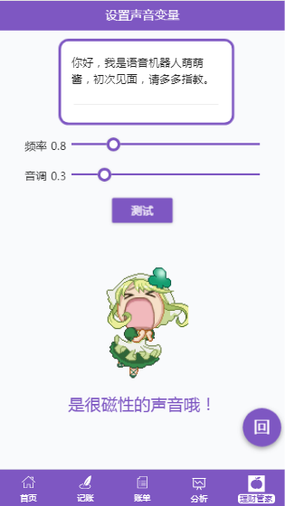

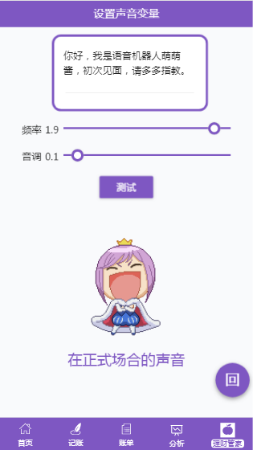

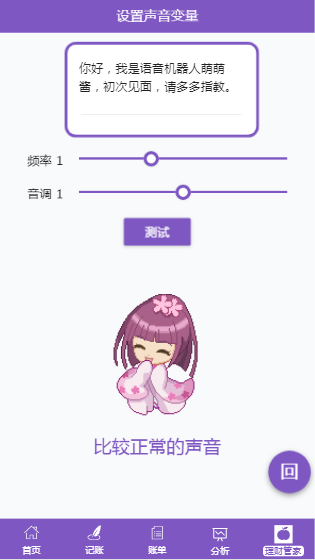

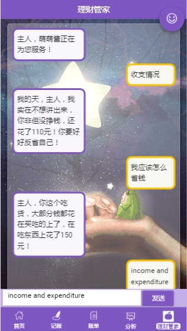

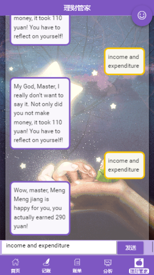